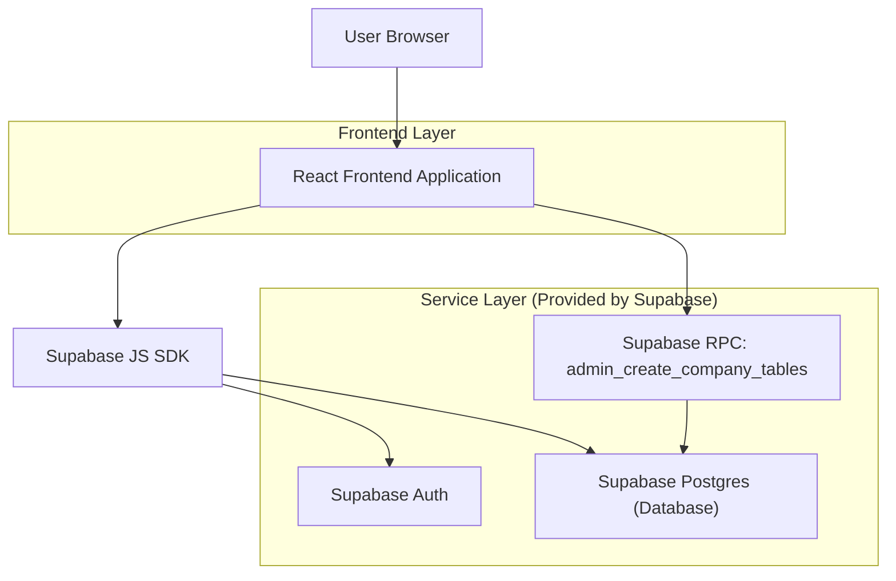

## 1.Architecture design


## 2.Technology Description
- Frontend: React@18 + TypeScript + vite + tailwindcss@3
- Backend: None (execução via Supabase Auth + função RPC no Postgres)
- Database: Supabase (PostgreSQL)

## 3.Route definitions
| Route | Purpose |
|-------|---------|
| /login | Autenticação do admin via Supabase Auth |
| /admin/importar | Landing do módulo Importar (atalhos e navegação) |
| /admin/importar/criar-tabelas | Formulário para definir colunas e disparar criação das tabelas no Supabase |

## 3.1 Estrutura de componentes/composables (frontend)
Estrutura sugerida (React + hooks, desktop-first):
- `src/pages/`
  - `LoginPage.tsx`
  - `admin/importar/ImportarPage.tsx` (lista/atalhos do módulo)
  - `admin/importar/CriarTabelasSupabasePage.tsx` (tela principal do formulário)
- `src/components/layout/`
  - `AdminLayout.tsx` (topbar + sidebar)
  - `AdminSidebar.tsx` (seção “Importar” com item “Criar Tabelas Supabase”)
  - `AdminTopbar.tsx` (título + logout)
- `src/components/importar/criar-tabelas/`
  - `EmpresaAdquirenteForm.tsx` (inputs “Empresa” e “Adquirente”)
  - `ColumnsEditor.tsx` (lista para adicionar/remover/reordenar colunas)
  - `ColumnRow.tsx` (perguntas “Nome do campo” e “Tipo”)
  - `PreviewPanel.tsx` (prévia de nomes de tabelas + colunas)
  - `CreateTablesButton.tsx` (botão que chama o backend)
- `src/composables/` (ou `src/hooks/`)
  - `useAuthSession.ts` (ler sessão e proteger rotas)
  - `useNormalizeIdentifier.ts` (normalizar empresa/adquirente para nome de tabela)
  - `useColumnsForm.ts` (estado/validações da lista de colunas)
  - `useCreateCompanyTables.ts` (executar chamada RPC e tratar loading/erro/sucesso)

## 6.Data model(if applicable)

### 6.1 Data model definition
As tabelas são geradas dinamicamente por **empresa + adquirente**, criando sempre 2 tabelas:
- `vendas__{empresa}__{adquirente}`
- `recebimentos__{empresa}__{adquirente}`

Cada tabela contém:
- Colunas definidas no formulário (lista de campos)
- Colunas técnicas mínimas (recomendadas): `id` (uuid), `created_at` (timestamptz)

### 6.2 Data Definition Language
**Função RPC (pré-requisito) – cria as duas tabelas com DDL dinâmico**

Observações de segurança (essenciais):
- Executar como `SECURITY DEFINER`.
- Validar/normalizar `empresa` e `adquirente` para um identificador seguro.
- Validar cada campo: nome seguro (regex) + tipo permitido (whitelist).

Exemplo de assinatura sugerida:
```sql
-- Função RPC chamada pelo frontend autenticado
-- Entrada: empresa, adquirente, e lista de colunas (nome+tipo)
CREATE OR REPLACE FUNCTION public.admin_create_company_tables(
  p_empresa text,
  p_adquirente text,
  p_columns jsonb
) RETURNS jsonb
LANGUAGE plpgsql
SECURITY DEFINER
AS $$
DECLARE
  v_empresa text;
  v_adquirente text;
  v_vendas_table text;
  v_receb_table text;
  v_cols_sql text;
BEGIN
  -- 1) normalizar/validar p_empresa e p_adquirente
  -- 2) montar nomes das tabelas
  -- 3) montar SQL das colunas a partir de p_columns (whitelist)
  -- 4) executar CREATE TABLE IF NOT EXISTS para vendas e recebimentos
  -- 5) retornar json com nomes das tabelas criadas
  RETURN jsonb_build_object('ok', true);
END;
$$;
```

**Permissões (diretriz Supabase)**
- Conceder leitura básica ao `anon` somente se necessário (em geral, para admin não é necessário).
- Conceder uso/execução da função e acesso total às tabelas geradas apenas para `authenticated` (ou, preferencialmente, para um papel lógico de admin via RLS/claims).

Exemplos (ajustar ao seu modelo de segurança):
```sql
GRANT EXECUTE ON FUNCTION public.admin_create_company_tables(text,text,jsonb) TO authenticated;

-- Se optar por permitir acesso às tabelas geradas para usuários autenticados:
-- GRANT ALL PRIVILEGES ON TABLE <tabela_gerada> TO authenticated;
```
