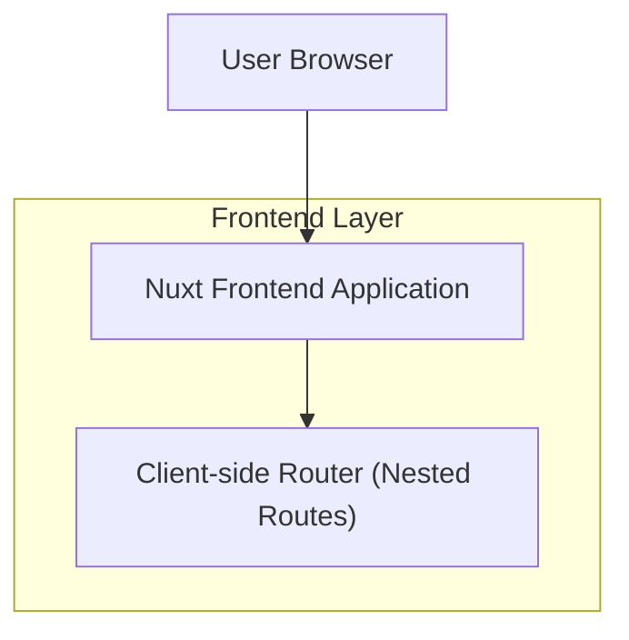

## 1.Architecture design

## 2.Technology Description
- Frontend: Nuxt@3 (Vue@3) + TypeScript
- Backend: None (escopo restrito à reorganização de rotas e estrutura de pastas)

## 3.Route definitions
| Route | Purpose |
|-------|---------|
| /configuracoes | Página principal (layout-base) de Configurações e ponto de entrada das subpáginas |
| /configuracoes/importacao | Subpágina Importação dentro de Configurações |
| /configuracoes/auditoria | Subpágina Auditoria dentro de Configurações |
| /configuracoes/cadastro | Subpágina Cadastro dentro de Configurações |

## 4.API definitions (If it includes backend services)
N/A

## 5.Server architecture diagram (If it includes backend services)
N/A

## 6.Data model(if applicable)
N/A

---

### Estrutura de pastas (alvo)
> Objetivo: alinhar **pages/composables/components** com a nova árvore “Configurações” e suas subpáginas.

**Pages (rotas aninhadas)**
- pages/
  - configuracoes/
    - index.vue (página principal / layout-base)
    - importacao.vue
    - auditoria.vue
    - cadastro.vue

**Composables (por domínio)**
- composables/
  - configuracoes/
    - useImportacao.*
    - useAuditoria.*
    - useCadastro.*

**Components (por seção/feature)**
- components/
  - configuracoes/
    - Navigation.*
    - Importacao.*
    - Auditoria.*
    - Cadastro.*
