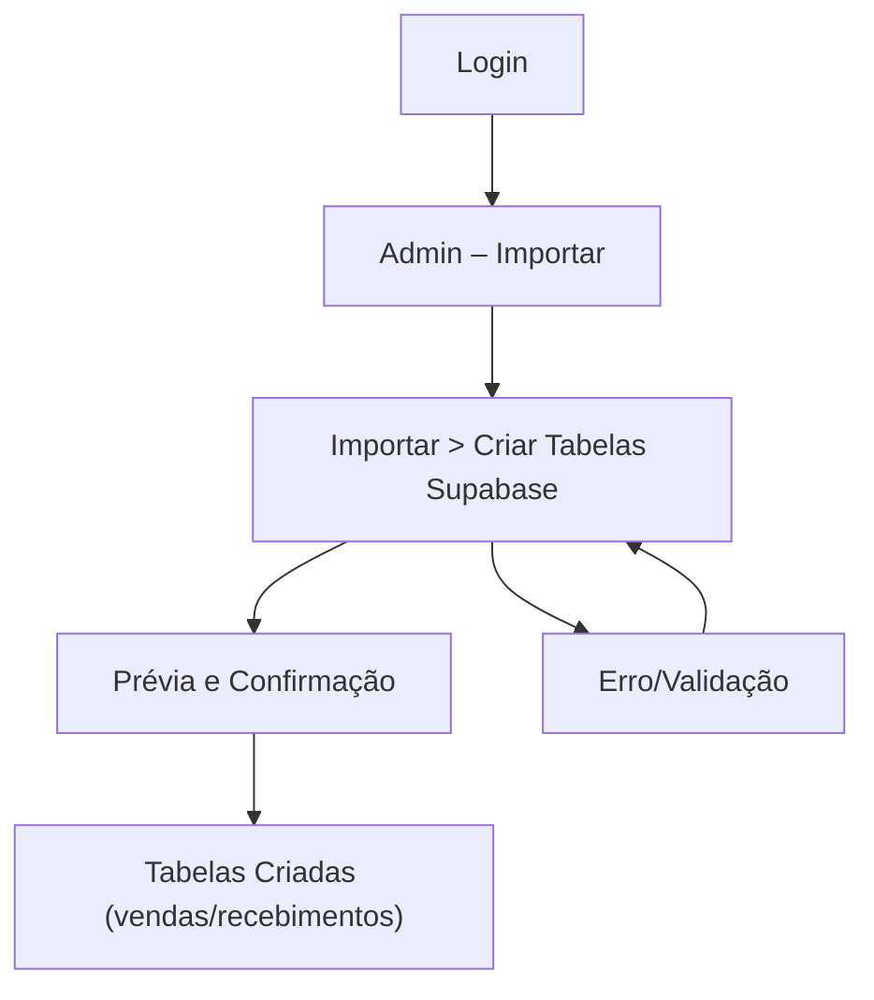

## 1. Product Overview
Página administrativa para gerar automaticamente duas tabelas no Supabase (vendas e recebimentos) a partir de um formulário com empresa, adquirente e definição de colunas.
Voltado para operação/implantação rápida de layouts de conciliação por empresa + adquirente.

## 2. Core Features

### 2.1 User Roles
| Papel | Método de cadastro | Permissões principais |
|------|---------------------|----------------------|
| Admin | Login via Supabase Auth (e-mail/senha) | Acessar /admin, definir colunas, solicitar criação das tabelas no banco |

### 2.2 Feature Module
1. **Login**: autenticação via Supabase.
2. **Admin – Importar**: página inicial do módulo de importação com navegação para as ferramentas.
3. **Importar > Criar Tabelas Supabase**: formulário (empresa + adquirente + campos), validação, prévia e execução da criação das duas tabelas via backend (RPC Supabase).

### 2.3 Page Details
| Page Name | Module Name | Feature description |
|-----------|-------------|------------------|
| Login | Formulário de autenticação | Autenticar com e-mail e senha via Supabase Auth; tratar erro de credenciais; redirecionar para /admin/importar após sucesso. |
| Admin – Importar | Controle de acesso | Verificar sessão autenticada; bloquear acesso não autenticado e redirecionar para /login. |
| Admin – Importar | Navegação do módulo | Exibir item de menu/atalho para “Criar Tabelas Supabase”; navegar para a subpágina selecionada. |
| Importar > Criar Tabelas Supabase | Controle de acesso | Verificar sessão autenticada; bloquear acesso não autenticado e redirecionar para /login. |
| Importar > Criar Tabelas Supabase | Formulário (perguntas) | Perguntar **Empresa** (texto) e **Adquirente** (select ou texto); validar obrigatórios; normalizar para uso em nome de tabela (remover acentos/espaços e caracteres inválidos). |
| Importar > Criar Tabelas Supabase | Definição de campos (colunas) | Permitir adicionar/remover/reordenar campos; perguntar **Nome do campo** e **Tipo** (texto, número, decimal, data, timestamp, booleano); validar duplicidade e caracteres inválidos. |
| Importar > Criar Tabelas Supabase | Prévia do que será criado | Exibir nomes finais das duas tabelas (vendas/recebimentos) e lista final de colunas; permitir confirmar antes de executar. |
| Importar > Criar Tabelas Supabase | Botão “Criar tabelas” (chamada backend) | Ao clicar, chamar o backend (RPC Supabase) para criar 2 tabelas (vendas e recebimentos) com as colunas definidas; exibir sucesso/erro com mensagem objetiva. |

## 3. Core Process
**Fluxo Admin**
1) Você acessa /login e autentica via Supabase.
2) Você entra em /admin/importar e escolhe a opção **Criar Tabelas Supabase**.
3) Você preenche as perguntas do formulário (Empresa, Adquirente) e define os campos (nome e tipo) que devem virar colunas.
4) Você confere a prévia (nomes das tabelas e colunas) e confirma.
5) Você clica no botão **Criar tabelas**, que chama o backend (RPC Supabase) para criar as tabelas de **vendas** e **recebimentos** e retorna o resultado.

