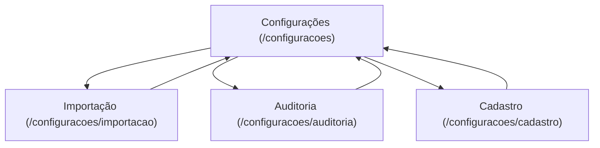

## 1. Product Overview
Reorganizar a área de **Configurações** para virar a página principal, com subpáginas dedicadas e rotas aninhadas.
O objetivo é simplificar navegação, padronizar URLs e refletir a nova árvore de pastas do front-end.

## 2. Core Features

### 2.1 User Roles
Não há distinção de papéis definida para esta reorganização.

### 2.2 Feature Module
A reorganização consiste nas seguintes páginas essenciais:
1. **Configurações**: layout-base, navegação interna para subpáginas, renderização de conteúdo aninhado.
2. **Importação**: página-filha acessada via rota aninhada.
3. **Auditoria**: página-filha acessada via rota aninhada.
4. **Cadastro**: página-filha acessada via rota aninhada.

### 2.3 Page Details
| Page Name | Module Name | Feature description |
|-----------|-------------|---------------------|
| Configurações | Layout e container | Exibir título/descrição da área e um container para conteúdo das subpáginas (nested view). |
| Configurações | Navegação interna | Navegar para Importação/Auditoria/Cadastro mantendo o prefixo `/configuracoes/*`. |
| Importação | Rota aninhada | Renderizar como subpágina de Configurações em `/configuracoes/importacao`. |
| Auditoria | Rota aninhada | Renderizar como subpágina de Configurações em `/configuracoes/auditoria`. |
| Cadastro | Rota aninhada | Renderizar como subpágina de Configurações em `/configuracoes/cadastro`. |

## 3. Core Process
1. Você acessa **/configuracoes** e vê a página principal de Configurações.
2. Você seleciona uma subpágina (Importação, Auditoria ou Cadastro) pela navegação interna.
3. A aplicação troca apenas o conteúdo interno, mantendo o layout-base de Configurações.

